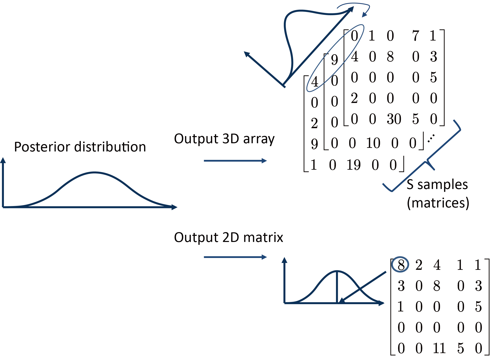

```{r, echo=FALSE, results="hide", message=FALSE}
require(knitr)
opts_chunk$set(error=FALSE, message=FALSE, warning=FALSE, dpi = 30)
knitr::opts_chunk$set(dev="png",fig.align="center")
```

```{r library, echo=FALSE}
library(bayNorm)
library(BiocStyle)
```

# Introduction 

bayNorm utilizes Bayesian model which involves cell-specific (a vector of probabilities (`BETA_vec`) of the length equal to the number of cells) and gene-specific parameters (`mu` and `size` in Negative Binomial distribution). 

1. For `BETA_vec`, you can either provide your own estimation about cell-specific parameters or the function `BetaFun` provided by bayNorm can be used.
2. For gene-specific parameters, bayNorm will firstly divide the input data by `BETA_vec` because we assumes that the observed counts are underestimated. then bayNorm will further estimate $\mu$ and $\phi$ for each gene.


bayNorm allows for normalizing either single group or multiple groups of cells:
1. **Single group normalization** bayNorm provides a function `noisy_gene_detection` for identifying highly variable genes (HVG) or in other workds noisy genes within the group. 
2. **Multiple groups normalization**: bayNorm allows for estimating prior parameters across multiple groups or within each group respectively. If the multiple groups of cells are the same, then by estimating parameters acroos groups allows for mitigating intrinsic noise or removing batch effect (as long as `BETA_vec` is accurate enough). If you want to study intrinsic noise, then you can estimate parameters within each group. 


## Bayesian model used in bayNorm
Let $x^0_{ij}$ denotes the original number of the $i^{\text{th}}$ gene in the $j^{\text{th}}$ cell. It is intuitively to assume that the corresponding observed count $x_{ij}$ follows a Binomial distribution with probability $\beta_j$ (capture efficiency) [@Klein__Droplet_2015]. 

\begin{itemize}
\item $x_{ij}\sim \text{B}(x_{ij}^0,prob=\beta_j)$
\item $x_{ij}^0 \sim \text{NB}(\text{mean}=\lambda_i\mu_i,\text{size}=\phi_i)$
\end{itemize}

$\phi$ is a dispersion parameter defined in negative binomial (NB) distribution such that $\sigma^2=\mu+\frac{\mu^2}{\phi}$. A gene with small $\phi$ means it could be a noisy gene.


## How does bayNorm work?
There are different procedures for estimating $\mu$ and $\phi$ in bayNorm:
\begin{itemzie}
{
\item For $\mu$, bayNorm always use estimates based on Moment Matching Estimation (MME).

\item If `BB_SIZE=FALSE`, then bayNorm also uses MME estimated $\phi$ (**fast**).

\item (**Default**) If `BB_SIZE=TRUE` and `FIX_MU=TRUE` , $\phi$ will be estimated by maximizing marginal distribution with respect to $\phi$ using `spg` function from CRANpkg("BB"). Then MME estimated $\phi$ will be adjusted according to BB estimated $\phi$ (**relatively slow, but robust**).

\item If `BB_SIZE=TRUE` and `FIX_MU=FALSE`, $\phi$ will be estimated by maximizing marginal distribution with respect to both $\phi$ and $\mu$. Then MME estimated $\phi$ will be adjusted according to BB estimated $\phi$ (**slow**).

}
\end{itemzie}


## What does bayNorm output? 
bayNorm can output either 3D array or 2D matrix. For 2D matrix, each element is the mode of the corresponding posterior distribution.



3D array and 2D matrix perform similar in downstream analysis. However since our Bayesian model does not result in a closed form for the posterior distribution, output of the form 3D array could be more useful. A certain number of samples can be viewed as a kind of bootstrapping. 

***


# Quick start: for either single or groups of cells
The main function is `bayNorm` which is a wrapper function of prior parameters estimation and normalized array or matrix generation. 

Essential parameters for running `bayNorm` are: 

* `Data`: a `SummarizedExperiment` object or matrix (rows: genes, columns: cells). 
* `BETA_vec`: a vector of probabilities which is of length equal to the number of cells. 
* `Conditions`: If `Conditions` is provided, prior parameters will be estimated within each group of cells (we name this kind of procedure as "LL" procedure where "LL" stands for estimating both $\mu$ and $\phi$ locally). Otherwise, bayNorm applied "GG" procedure for estimating prior parameters (estimating both $\mu$ and $\phi$ globally).
* `Prior_type`: Even if you have specified the `Conditions`, you can still choose to estimate prior parameters across all the cells.

***

## How to estimate capture efficiencies (`BETA_vec`)?
There are many different ways for estimating $\beta$:

* The first method just utilize the raw data that we have. In bayNorm we provide a function `BetaFun` for estimating $\beta$ for each cell. Firstly `BetaFun` selects a subset of genes which are not outliers and having low dropout rates. Then we normalized the total counts of the subset of genes to a certain mean capture efficiency (`MeanBETA`: $\bar{\beta}$). The mean capture efficiency can be estimated via Spike-ins or Single molecule fluorescent in situ hybridization (smFISH) data. 

* Another way is to utilize spike-ins. We can divide the total number of spike-ins in each cell by the theoretical number of input spike-ins. Or fit a linear regression within each cell for spike-ins.  

* A more accurate estimation is to utilize the smFISH data. 

   


```{r intro_bayNorm, echo=TRUE,eval=FALSE}
data('EXAMPLE_DATA_list')
#Return 3D array normalzied data:
bayNorm_3D<-bayNorm(Data=EXAMPLE_DATA_list$inputdata,
BETA_vec = EXAMPLE_DATA_list$inputbeta,mode_version=F)

#Return 2D matrix normalized data:
bayNorm_2D<-bayNorm(Data=EXAMPLE_DATA_list$inputdata,
BETA_vec = EXAMPLE_DATA_list$inputbeta
,mode_version=T)
```

## Non-UMI scRNAseq dataset
bayNorm's mathematical model is suitable for UMI dataset. However it can be also applied on non-UMI dataset. In `bayNorm`, you need to specify the following parameter:
* `UMI_sffl`: bayNorm can also be applied on the non-UMI dataset. However, user need to provide a scaled number. Raw data will be divided by the scaled number and bayNorm will be applied on the rounded scaled data. By doing so, the Dropout vs Mean expression plots will be similar to that of UMI dataset.


## Generate 3D array or 2D matrix with existing estimated prior parameters.
If you have run bayNorm on a dataset before but want to output another kind of data (3D array or 2D matrix), you can use the function `bayNorm_sup`. It is important to input the existing estimated parameters by specifying the following parameter in `bayNorm_sup`:
* `BETA_vec`: If `Conditions` has been specified previously, then input `unlist(bayNorm_output$BETA)`
* `PRIORS`: `input bayNorm_output$PRIORS_LIST`
* `Conditions`: make sure to specify the same `Conditions` as before.
You can find these two objects from the previous output of bayNorm function, which is a list.

```{r intro_bayNorm_sup, echo=TRUE,eval=FALSE}
data('EXAMPLE_DATA_list')
#Return 3D array normalzied data:
bayNorm_3D<-bayNorm(Data=EXAMPLE_DATA_list$inputdata,
BETA_vec = EXAMPLE_DATA_list$inputbeta
,mode_version=F)

#Now if you want to generate 2D matrix using the same prior
#estimates as generated before:
bayNorm_2D<-bayNorm_p(Data=EXAMPLE_DATA_list$inputdata
,BETA_vec= bayNorm_3D$BETA,PRIORS=bayNorm_3D$PRIORS_LIST
,mode_version=T)
```


# Methodology

* $x_{ij}$: Observed UMI count for the $i^{\text{th}}$ gene in the $j^{\text{th}}$ cell.
* $x_{ij}^0$: Original UMI count for the $i^{\text{th}}$ gene in the $j^{\text{th}}$ cell.

The posterior distribution is estimated for each gene in each cell:
\begin{equation}
\underbrace{\Pr(x_{ij}^0|x_{ij},\mu_i,\phi_i,\beta_j)}_\text{Posterior} \propto\underbrace{\Pr(x_{ij}|x_{ij}^0,\beta_j)}_\text{Likelihood: Binomial}\times\underbrace{\Pr(x_{ij}^0|\mu_i,\phi_i)}_\text{Prior: NB}
\end{equation}


Firstly, an estimation about the capture efficiencies of each cell should be provided (`BETA_vec`). If not, then bayNorm will normalized total counts of cells to 0.06 as `BETA_vec`.

Secondly, we divide the input data `Data` by `BETA_vec` because we assume that the observed counts are underestimated. Then bayNorm will apply a procedure which is determined by the user for estimating $\mu$ and $\phi$ for each gene.

After estimating prior parameters, we used 1D grid approximation method for estimaing posterior distribution for each gene in each cell.

Lastly, bayNorm will output normalized data of the form either 3D array or 2D matrix.


***

# Acknowledgements


***

# Session information

```{r SessionInfo}
sessionInfo()
```

***

# References


