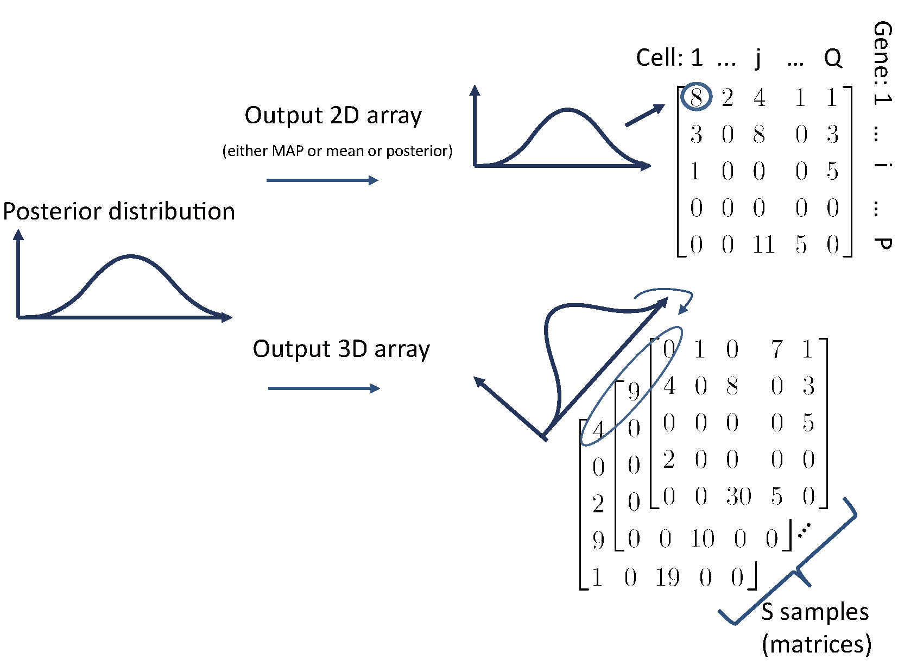

```{r, echo=FALSE, results="hide", message=FALSE}
require(knitr)
opts_chunk$set(error=FALSE, message=FALSE, warning=FALSE, dpi = 30)
knitr::opts_chunk$set(dev="png",fig.align="center")
```

```{r library, echo=FALSE}
library(bayNorm)
library(BiocStyle)
```

# Introduction 

Normalisation is an important step for the single cell RNA sequencing (scRNA-seq) data analysis. Typically, this is done through global scaling using some estimated global scaling factors. bayNorm introduces an alternative approach, in which the original transcript counts are estimated using a Bayesain approach. The outputs are therefore samples from the posterior distrubution. It also imputes results for drop-outs (genes with zero count). The likelihood function used is a binomial model and requires cell-specific capture efficiencies (a vector of probabilities (`BETA_vec`) of the length equal to the number of cells). The prior which is assumed to be Negative Binomial has gene-specific parameters (`mu` and `size` in Negative Binomial distribution) and is estimated using an emperical bayes approach. 

1. For `BETA_vec`, you can either provide your own estimation about cell-specific parameters or the function `BetaFun` provided by bayNorm can be used. These are proportional to global scaling factors and mean capture efficiency across all cells (should be <1). There are many different ways for estimating $\beta$. It can be estimated using existing methods of estimating global scaling factors based on the data, or using the spike-ins. Alternatively, in bayNorm we provide a function `BetaFun` for estimating $\beta$ for each cell. Firstly `BetaFun` selects a subset of genes which are not outliers and having low dropout rates. Then we normalized the total counts of the subset of genes to a certain mean capture efficiency (`MeanBETA`: $\bar{\beta}$). The mean capture efficiency can be estimated via Spike-ins or Single molecule fluorescent in situ hybridization (smFISH) data. 


2. For gene-specific parameters, bayNorm will firstly perform a simple normalization using $\beta$: $x'_{ij}=x_{ij}/\sum_i{x_{ij}}<(\sum_i{x_{ij}}/\beta_j)>$. Then bayNorm will estimate $\mu$ and $\phi$ for each gene using an emperical bayes approach based on the simple normalized data $x'_{ij}$.


## Bayesian model used in bayNorm
Let $x^0_{ij}$ denotes the original number of the $i^{\text{th}}$ gene in the $j^{\text{th}}$ cell. The corresponding observed count $x_{ij}$ follows a Binomial distribution with probability $\beta_j$ (capture efficiency) [@Klein__Droplet_2015]. 

\begin{itemize}
\item $x_{ij}\sim \text{B}(x_{ij}^0,prob=\beta_j)$
\item $x_{ij}^0 \sim \text{NB}(\text{mean}=\lambda_i\mu_i,\text{size}=\phi_i)$
\end{itemize}

$\phi$ is a dispersion parameter defined in negative binomial (NB) distribution such that $\sigma^2=\mu+\frac{\mu^2}{\phi}$. A gene with small $\phi$ means it could be a noisy gene.

* $x_{ij}$: Observed UMI count for the $i^{\text{th}}$ gene in the $j^{\text{th}}$ cell.
* $x_{ij}^0$: Original UMI count for the $i^{\text{th}}$ gene in the $j^{\text{th}}$ cell.

The posterior distribution is estimated for each gene in each cell:

\begin{equation}
\underbrace{\Pr(x_{ij}^0|x_{ij},\mu_i,\phi_i,\beta_j)}_\text{Posterior} \propto\underbrace{\Pr(x_{ij}|x_{ij}^0,\beta_j)}_\text{Likelihood: Binomial}\times\underbrace{\Pr(x_{ij}^0|\mu_i,\phi_i)}_\text{Prior: NB}
\end{equation}


Firstly, an estimation about the capture efficiencies of each cell should be provided (`BETA_vec`). If not, then bayNorm will normalized total counts of cells to 0.06 as `BETA_vec`.

Secondly, we divide the input data `Data` by `BETA_vec` because we assume that the observed counts are underestimated. Then bayNorm will apply a procedure which is determined by the user for estimating $\mu$ and $\phi$ for each gene.

After estimating prior parameters, we used 1D grid approximation method for estimaing posterior distribution for each gene in each cell.

Lastly, bayNorm will output normalized data of the form either 3D array or 2D matrix.


## How does prior estimation in bayNorm work?
There are different methods for estimating $\mu$ and $\phi$ in bayNorm:

1. For $\mu$, bayNorm always use estimates based on Moment Matching Estimation (MME).

2. If `BB_SIZE=FALSE`, then bayNorm also uses MME estimated $\phi$ (**fast**).

3. If `BB_SIZE=TRUE` and `FIX_MU=FALSE`, $\phi$ and $\mu$ will be estimated by maximizing marginal distribution with respect to both $\phi$ and $\mu$. Then MME estimated $\phi$ will be adjusted according to BB estimated $\phi$ (**relatively slow and not robust**).

4. (**Default and recommended option**) If `BB_SIZE=TRUE` and `FIX_MU=TRUE` , $\phi$ will be estimated by maximizing marginal distribution with respect to $\phi$ using `spg` function from `r CRANpkg("BB")`. Then MME estimated $\phi$ will be adjusted according to BB estimated $\phi$ (**slow, but robust**).


In addition, the priors can be estimated either using all cells as a single group or multiple groups of cells:

1. **Single group prior estimation** In this case one set of $\mu$ and $\phi$ is estimated for each gene using data across all cells. This is the default option, when we don't have prior knowledge about different cells belonging to different biological categories. This will also reduce batch effect if the group consists of different batches. In addition bayNorm provides a function `noisy_gene_detection` for identifying highly variable genes (HVG) or in other words noisy genes within the group. 

2. **Multiple prior estimation**: When there are two or more groups of cells, baynorm allows for different sets of prior parameters $\mu$ and $\phi$ be estimated for each group. This can help increase the resolution of Differential Expression (DE) analysis.  


## What does bayNorm output? 
bayNorm can output the posterior distribution as a 3D array or point estimate from the posterior as 2D matrix. For  point estimates, there is option of each element being mode (maximum a posteriori probability (MAP)) or mean of the corresponding posterior distribution. For the mean version normalized data, it is obtained by taking average over 1000 samples since there is no closed form for the posterior.



The point estimates (2D matrix) performs similar to common normalisation methods such as global scaling, where for each data point there is corresponding normalised estimate. Since our Bayesian model does not result in a closed form for the posterior distribution, the 3D array are samples from the posterior and they could be useful in down-stream analysis viewed as they also capture the variability in the estimates. 

***


# Quick start: for either single or groups of cells
The main function is `bayNorm` which is a wrapper function of prior parameters estimation and normalized array or matrix generation. 

Essential parameters for running `bayNorm` are: 

* `Data`: a `SummarizedExperiment` object or matrix (rows: genes, columns: cells). 
* `BETA_vec`: a vector of probabilities which is of length equal to the number of cells. 
* `Conditions`: If `Conditions` is provided, prior parameters will be estimated within each group of cells (we name this kind of procedure as "LL" procedure where "LL" stands for estimating both $\mu$ and $\phi$ locally). Otherwise, bayNorm applied "GG" procedure for estimating prior parameters (estimating both $\mu$ and $\phi$ globally).
* `Prior_type`: Even if you have specified the `Conditions`, you can still choose to estimate prior parameters across all the cells by setting `Prior_type="GG"`.

***

   


```{r intro_bayNorm, echo=TRUE,eval=FALSE}
data('EXAMPLE_DATA_list')
#Return 3D array normalzied data:
bayNorm_3D<-bayNorm(
    Data=EXAMPLE_DATA_list$inputdata,
    BETA_vec = EXAMPLE_DATA_list$inputbeta,
    mode_version=F,
    mean_version = F)

#Return 2D matrix normalized data (MAP of posterior):
bayNorm_2D<-bayNorm(
    Data=EXAMPLE_DATA_list$inputdata,
    BETA_vec = EXAMPLE_DATA_list$inputbeta,
    mode_version=T,
    mean_version = F)

#Return 2D matrix normalized data (mean of posterior):
bayNorm_2D<-bayNorm(
    Data=EXAMPLE_DATA_list$inputdata,
    BETA_vec = EXAMPLE_DATA_list$inputbeta,
    mode_version=F,
    mean_version = T)
```

## Non-UMI scRNAseq dataset
bayNorm's mathematical model is suitable for UMI dataset. However it can be also applied on non-UMI dataset. In `bayNorm`, you need to specify the following parameter:
* `UMI_sffl`: bayNorm can also be applied on the non-UMI dataset. However, user need to provide a scaled number. Raw data will be divided by the scaled number and bayNorm will be applied on the rounded scaled data. By doing so, the Dropout vs Mean expression plots will be similar to that of UMI dataset.


## Generate 3D array or 2D matrix with existing estimated prior parameters.
If you have run bayNorm on a dataset before but want to output another kind of data (3D array or 2D matrix), you can use the function `bayNorm_sup`. It is important to input the existing estimated parameters by specifying the following parameter in `bayNorm_sup`:
* `BETA_vec`: If `Conditions` has been specified previously, then input `unlist(bayNorm_output$BETA)`
* `PRIORS`: `input bayNorm_output$PRIORS_LIST`
* `Conditions`: make sure to specify the same `Conditions` as before.
You can find these two objects from the previous output of bayNorm function, which is a list.

```{r intro_bayNorm_sup, echo=TRUE,eval=FALSE}
data('EXAMPLE_DATA_list')
#Return 3D array normalzied data:
bayNorm_3D<-bayNorm(
    Data=EXAMPLE_DATA_list$inputdata,
    BETA_vec = EXAMPLE_DATA_list$inputbeta,
    mode_version=F,
    mean_version = F)

#Now if you want to generate 2D matrix (MAP) using the same prior
#estimates as generated before:
bayNorm_2D<-bayNorm_p(
    Data=EXAMPLE_DATA_list$inputdata,
    BETA_vec= bayNorm_3D$BETA,
    PRIORS=bayNorm_3D$PRIORS_LIST,
    mode_version=T,
    mean_version = F)

#Or you may want to generate 2D matrix 
#(mean of posterior) using the same prior
#estimates as generated before:
bayNorm_2D<-bayNorm_p(
    Data=EXAMPLE_DATA_list$inputdata,
    BETA_vec= bayNorm_3D$BETA,
    PRIORS=bayNorm_3D$PRIORS_LIST,
    mode_version=F,
    mean_version = T)
```


***

# Session information

```{r SessionInfo}
sessionInfo()
```

***

# References


